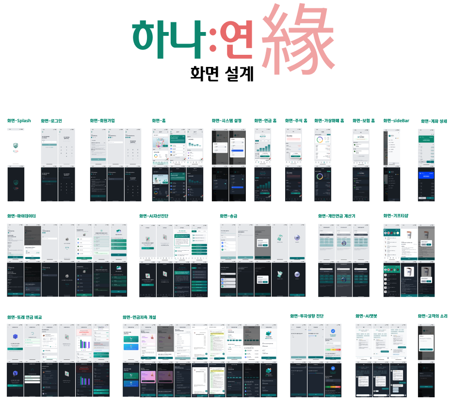

# 하나:연(緣)

### 연금 기반 통합 자산관리 플랫폼

### https://myhanati.site (모바일 앱 최적화)

## 프로젝트 구조

> 본래 개별 레포지토리로 관리되지만, 제출 편의상 통합되어 있습니다.

| 디렉토리                | 설명                      |
| ----------------------- | ------------------------- |
| `hana-yeon-front`       | 하나:연(緣) 프론트엔드    |
| `hana-yeon-back`        | 하나:연(緣) 백엔드        |
| `openBanking-back`      | 마이데이터 백엔드         |
| `hanaBank-back`         | 하나은행 백엔드           |
| `shinhanBank-back`      | 신한은행 백엔드           |
| `dbLife-back`           | DB생명 백엔드             |
| `third-party-auth-back` | 제3인증기관 (PASS) 백엔드 |
| `sql-example`           | SQL예시                   |
| `산출물`                | 기능명세서, ERD 등 산출물 |

## 디자인&화면

### [Figma 링크](https://www.figma.com/design/HhLEXprJMyHK8w2au9w4F5/%ED%95%98%EB%82%98-%EC%97%B0-%ED%99%94%EB%A9%B4%EC%84%A4%EA%B3%84?node-id=0-1&t=ckt9KtXVzEpbEfbB-0)

## 1. 프로젝트 소개

> 은퇴 후 나의 연금 수령액을 또래와 비교해주는 연금 기반 금융 가이드

## 2. 기획 배경

 
 

- 4대 은행의 시니어 고객 비중이 높아지고 있으며 (고령화), 여러 정책적/사회적 이슈로 연금에 대한 관심이 커지고 있습니다.
- 2024년 연금저축 적립액은 10조원이 증가하였으며, 일시적인 수치가 아닌 꾸준히 증가하는 수치입니다.

## 3. 주요 기능

 
 

- 마이데이터: 계좌/주식/보험/가상화폐 조회 및 송금이 가능합니다.
- 또래와 연금 비교: 단순 연금 시뮬레이터가 아닌, 보유한 <strong>모든</strong> 연금의 예상 수령액을 또래와 비교합니다.
- AI 자산진단: 사용자의 종합자산 상태를 진단해줍니다.
- AI 챗봇: 금융가이드에 걸맞게, 어려운 연금/금융 지식을 알려줍니다.

## 4. 서비스 아키텍처

 
 

## 5. 기술 아키텍처

## 6. 인프라 아키텍처

 
 

- FE - AWS Amplify
- BE - AWS EC2 + ALB
- 오픈캥킹 BE - AWS EC2 + ALB
- 하나은행 및 기타 금융 BE - AWS Lambda
- 모니터링 및 로깅 - AWS CloudWatch

## 개발자

| 구분          | 내용                            | 비고                                                                                                                                                                                                                                                                                                                                                                                                                                                                                                                                                                                                                                                                                                                                                                    |
| ------------- | ------------------------------- | ----------------------------------------------------------------------------------------------------------------------------------------------------------------------------------------------------------------------------------------------------------------------------------------------------------------------------------------------------------------------------------------------------------------------------------------------------------------------------------------------------------------------------------------------------------------------------------------------------------------------------------------------------------------------------------------------------------------------------------------------------------------------- |
| **이름**      | 이재혁                          | [블로그](https://blog-hyeok9.vercel.app)                                                                                                                                                                                                                                                                                                                                                                                                                                                                                                                                                                      |
| **연락처**    | 이메일                          | leejaehyuck9@khu.ac.kr                                                                                                                                                                                                                                                                                                                                                                                                                                                                                                                                                                                                                                                                                                                                                  |
| **학력**      | 경희대학교                      | 컴퓨터공학과                                                                                                                                                                                                                                                                                                                                                                                                                                                                                                                                                                                                                                                                                                                                                            |
| **Skill Set** | Language                        |                                                                                                                                                                                                                              |
|               | Framework                       |        |
|               | DBMS                            |                                                                                                                                                                                                                                                                                                                                                                                                                                                                                                                                                               |
|               | ETC                             |                                                                                                                                                                                                                                                                                                                                               |
| **어학**      | OPIc (IH)                       | 2024.06.08                                                                                                                                                                                                                                                                                                                                                                                                                                                                                                                                                                                                                                                                                                                                                              |
| **경력**      | 캐시닥 인턴 (2022.12 ~ 2023.06) | [캐시닥 병원이벤트](https://hospitalevent.cashdoc.me) 개발                                                                                                                                                                                                                                                                                                                                                                                                                                                                                                                                                                                                                                                                                                              |
|               |                                 | [캐시닥 커뮤니티](https://cashdoc.moneple.com) 개발                                                                                                                                                                                                                                                                                                                                                                                                                                                                                                                                                                                                                                                                                                                     |
